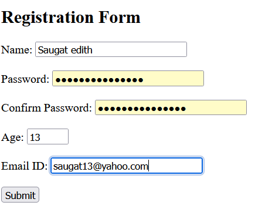

# QN starts from here
#### 1. Jagged array element with sum of each row.
#### 2. WAP To create basic class fruit which has name Taste and size as it attributes and method called eat Which describe name and taste. inherit the same in two other classes apple and oranges and override eat method to  represent each fruit taste.  
#### 3. WAP to inherit class circle square triangle from base class shape and calculate area in each class.

#### 4. Create a class Bank account with properties account and balance Ensure that the balance can't be set to negative value if an attempt is made to set negative value it should leave the balance unchanged and print error message.
#### 5. Create a class rectangle with properties length and width . Add a Read only property area that calculate the area using length and width property.
#### 6. Unary operator overloading
#### 7. Binary operator overloading
#### 8. Relational operator overloading
#### 9. WAP to create a class time which represents time. The class should have three fields for hours , minutes, seconds . It should have constructor to initialize hours minutes and second and method display time() print current time. overload following operator
##### a) +(add two time object on 24 hrs clock)
##### b) < (compare 2 times object )
#### 10. WAP to  show fully qualified namespace.
#### 11. Using Directive.
#### 12. WAP to implement List.
#### 13. WAP to implement Queue.
#### 14. WAP from generics to implement stack using Rush.
#### 15. WAP from generics method to implement a Stack using POP
#### 16. WAP to implement generics class using Dictionary
#### 17. WAP that will read college name from the keyboard and display it in the terminal.The program should throw an expection if length is more than 50.
#### 18. WAP that will read balance and withdraw amount from keyboard and display the remaining balance on screen.If balance is less then Withdraw amout throw an Application Exception with appropriate message.
#### 19. WAP to implement singlecast delegate.
#### 20. WAP to implement multicast delegate using System.
#### 21. WAP to implement func delegate from generic delegate.
#### 22. WAP to implement action delegate from generic delegate.
#### 23. WAP to implement predicate delegate from generic delegate.
#### 24. WAP to Select employees Whose salary>20000 & address is Kathmandu using LINQ.
#### 25. Write a web application program to impliment a form having name,address,gender and country.
#### 26. Write a web application program to impliment a form Given below.
#### 27. Provided that mysql database name "company" with lable named "product" with following columns (productID as int,Product name as varchar 120) and unitewise as float.Write a c# program to connect to the DB & display record that have unitewise is grater then 1000 & update the product record from product DB whose product id=50.
#### 28. Write a web application program to create student reg form in one asp.net page and display the field data in another asp.net page.
#### 29. Write a web application program to impliment a form for calculating Simple intrest in one asp.net page and display in another asp.net page.



**Note**:
```Python
def run_the_code:
    '''
    To Run the code Comment all the other .CS Extensions code then uncomment the code you want to run then run the code
    '''
print run_the_code.__doc__

```


